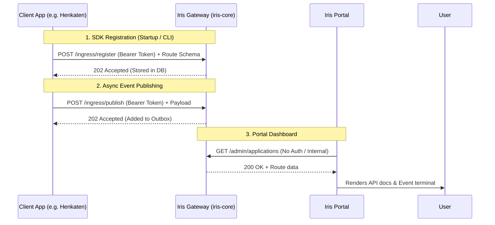

# IRIS Ecosystem Documentation

This document explains the architecture, integration patterns, and troubleshooting steps for the full Iris ecosystem: `iris-core` (the gateway), `iris-portal` (the UI dashboard), and the various SDKs (PHP/Laravel and JS/Node).


## Important (READ ME): 
 if users had already use or implemented a secure api system with thier own architectures and connection, make a new rules for the security api (if they use custom api connection or security) so iris could talk to the api without getting blocked or declined, without breaking they apis like without broke: 1. the api flow, 2. thier api securities system or infrasctructures, change any logics on the api, IRIS just need an special access / confirmation so the iris are not inlcuded on thier security logics

for example:
 i have an henkaten app where i implement my own api security systems and logic, when i has been integrate iris it got bloked like {message:unauthenticated} and i only could read api public like /api/health, etc..., and i cant get access into thier main apis cause of that 'api security', so with this case iris must have a special access level to thier api
---

## 1. Architecture



**How it works:**
The ecosystem separates concerns cleanly. 
- **`iris-core`** is the central gateway. It holds the single-source-of-truth database (MySQL) and rabbitMQ connections.
- **Client SDKs** (PHP or JS) live inside your microservices (like the Henkaten app). They are responsible for pushing their route schemas and events to the gateway. They do NOT connect to the database directly; they only communicate via HTTP to `/ingress/*` using a secure token.
- **`iris-portal`** is a read-only dashboard. It fetches data directly from the gateway's `/admin/*` endpoints to visualize the network.

---

## 2. Zero-Config Discovery: The "No Hardcoding" Guarantee

> **⚠️ CURRENT STATUS: TODO / NOT FULLY IMPLEMENTED**
> 
> The architecture specification demands a "zero-config, no hardcoding" registration mechanism where a client app automatically registers itself on first boot using a rotating secret handshake, completely removing the need for a developer to copy-paste an Application ID or Token.
>
> **Actual Codebase Reality:** This auto-registration handshake does NOT exist yet. Currently, you **must** manually create the application in the Iris database (via the Admin API or Prisma script) to generate an `IRIS_PROJECT_TOKEN`, and then manually paste that token into your app's `.env` file. 
> 
> *Future implementation needed:* The SDK should generate a unique asymmetric keypair on install, push the public key to a new `/ingress/handshake` endpoint on the gateway using a one-time provisioning slug, and receive the permanent token in response.

---

## 3. PHP / Laravel SDK Integration

### Installation
The PHP SDK is a single, zero-dependency file (`Iris.php`). You don't need composer to download a massive package.
1. Copy `Iris.php` into your Laravel app (e.g., `app/Services/Iris.php`).
2. Register it using a Service Provider (`app/Providers/IrisServiceProvider.php`).

### Configuration
Add these to your `.env`:
```env
IRIS_PROJECT_TOKEN=your_generated_token_here
IRIS_GATEWAY_URL=http://localhost:3001
```

### The `php artisan iris:sync` Command
In Laravel 11, routing files are loaded *after* Service Providers boot. Because of this, and to prevent adding 100ms+ of latency to every web request, we **do not** sync routes automatically on `boot()`.

Instead, use the artisan command:
```bash
php artisan iris:sync
```
**What it actually does:**
1. Loads the Laravel environment and boots the framework.
2. Extracts all registered routes via `Route::getRoutes()`.
3. Normalizes them into the Iris Route Schema format.
4. Makes a single `POST /ingress/register` call to the gateway using the `.env` token.
5. *Note: It does not cache schemas locally or re-issue tokens. It simply pushes the current state.*

**When to run it:** Run this manually when adding new routes, or add it to your CI/CD deployment script so it runs automatically during deploys.

### Minimal Usage (Publishing an Event)
```php
use App\Services\Iris;

public function completeOrder(Iris $iris) {
    // Process order...
    
    // Fire and forget — durable outbox handles the rest
    $iris->publish('order_completed', ['order_id' => 123]);
}
```

---

## 4. JS / Node SDK Integration

> **⚠️ REVISED SETUP — read before installing.** A plain `npm install @sugity/iris-node` followed by the naive Express wiring below used to be the documented path, but four undocumented traps in that flow caused routes to silently vanish or the process to crash on boot. The steps below are the corrected, known-good flow; each callout maps to the trap it fixes.

### Installation
Add a setup script to `package.json` rather than installing the package directly — the SDK ships from the IRIS monorepo, not a standalone registry publish:
```json
"scripts": {
  "setup:iris": "git clone --depth 1 --sparse https://github.com/RizkyDaffy/IRIS.git .iris-tmp && cd .iris-tmp && git sparse-checkout set SDK/JS && cd .. && npm install ./.iris-tmp/SDK/JS --install-links --legacy-peer-deps"
}
```
```bash
npm run setup:iris
```
**Do not delete `.iris-tmp` afterward.** `--install-links` places a `file:.iris-tmp/SDK/JS` reference in `package.json`'s dependencies — if `.iris-tmp` is deleted, the next plain `npm install` (yours or a teammate's) finds the link target missing and silently drops the SDK from the project. Add `.iris-tmp` to `.gitignore` instead of removing it.

### Compatibility: Express 4.x only (for now)
`registerExpressApp()` reads Express's internal `app._router.stack` / `layer.regexp`. Express 5.x rewrote these behind closures (`layer.matchers`), so on Express 5 the discovery walk fails silently — no error, but **zero routes** reach the gateway. Pin Express to 4.x until the SDK adds 5.x support:
```bash
npm install express@^4.21.1 @types/express@^4.17.21
```

### Configuration
Give your API and the gateway distinct ports. Both default to `3001`-adjacent ranges, and if they collide, route payloads get sent to your own backend instead of the gateway — your backend 404s, the SDK swallows the error, and the routes just never show up with no clear signal why.
```env
API_PORT=4000
IRIS_PROJECT_TOKEN=your_generated_token_here
IRIS_GATEWAY_URL=http://localhost:3001
```

### Auto-Sync Mechanism
Unlike PHP, long-running Node apps (like Express or Fastify) build their route trees synchronously at startup. The JS SDK includes framework-specific discovery wrappers that hook into this process.

```typescript
import express from 'express';
import { Iris } from '@sugity/iris-node';
import { registerExpressApp } from '@sugity/iris-node/express';

// Always pass an explicit object. `new Iris()` with zero arguments throws
// (it reads .projectToken off an undefined config) before it ever gets a
// chance to fall back to IRIS_PROJECT_TOKEN from .env — `new Iris({})` avoids that.
const iris = new Iris({});
const app = express();

app.get('/api/users', (req, res) => res.send([]));

const server = app.listen(process.env.API_PORT ?? 4000, async () => {
    try {
        // 1. Validates token against gateway
        await iris.init();

        // 2. Auto-discovers Express stack and POSTs to /ingress/register
        await registerExpressApp(iris, app);
    } catch (err) {
        // Non-fatal — a gateway outage at boot shouldn't crash the app
        console.error('IRIS sync failed:', err.message);
    }
});
```
**What it actually does:** `registerExpressApp` walks the internal Express `_router.stack`, pulls out the defined paths and methods, normalizes regex paths, and syncs them to the gateway.

### Minimal Usage (Publishing an Event)
```typescript
app.post('/api/checkout', async (req, res) => {
    // publish() falls back to an in-memory queue if the gateway is down
    await iris.publish({ event: 'checkout_started', data: req.body });
    res.send('ok');
});
```

---

## 5. Troubleshooting & Maintenance


### Common Sync Failures

**1. Route count shows 0 in portal (PHP/Laravel)**
- *Cause:* You tried to put `$iris->syncRoutes()` inside a Service Provider's `boot()` method in Laravel 11. 
- *Fix:* Use `php artisan iris:sync`. The routes don't exist yet when `boot()` runs.

**2. "Failed to connect to iris-core [401]" in Portal**
- *Cause:* You have a zombie Node process running on port 3001 that is intercepting requests with stale code.
- *Fix:* Run `kill-port 3001` or manually kill the PIDs found via `netstat -ano | findstr ":3001"`.

**3. "Unauthorized: invalid token" during `iris:sync` or `iris.init()`**
- *Cause:* The `IRIS_PROJECT_TOKEN` in your `.env` does not match any application in the gateway's MySQL database. 
- *Fix:* Make sure the gateway is using the correct database (check `DATABASE_URL` in `iris-core`), or generate a new token and update your `.env`.

**4. Prisma "Can't reach database server"**
- *Cause:* You restarted your machine and XAMPP MySQL didn't start automatically.
- *Fix:* Open XAMPP Control Panel and start MySQL. No other config needed.

**5. SDK disappears after a teammate runs `npm install` (JS/Node)**
- *Cause:* `setup:iris` used `--install-links`, which points `package.json` at `file:.iris-tmp/SDK/JS`, and someone later ran `rm -rf .iris-tmp`. The next plain install can't resolve the link and drops the SDK.
- *Fix:* Never delete `.iris-tmp` after running `setup:iris`. Add it to `.gitignore` instead of removing it.

**6. Route count shows 0 in portal, no errors logged (JS/Express)**
- *Cause:* Your project is on Express 5.x. `registerExpressApp()` reads Express 4-only internals (`_router.stack` / `layer.regexp`) and fails silently on Express 5's rewritten internals.
- *Fix:* Pin `express` and `@types/express` to `^4.x` until the SDK supports Express 5.

**7. `TypeError: Cannot read properties of undefined (reading 'projectToken')` on startup (JS)**
- *Cause:* Calling `new Iris()` with zero arguments — the constructor doesn't default its config parameter, so it throws before it can fall back to `.env`.
- *Fix:* Always call `new Iris({})` instead of `new Iris()`.

**8. Routes never appear in portal, backend logs a 404 for the sync request (JS)**
- *Cause:* Your API and `IRIS_GATEWAY_URL` are running on the same port, so the SDK's requests are hitting your own backend instead of the gateway.
- *Fix:* Set an explicit `API_PORT` distinct from the gateway's port (e.g. `4000` vs `3001`).
