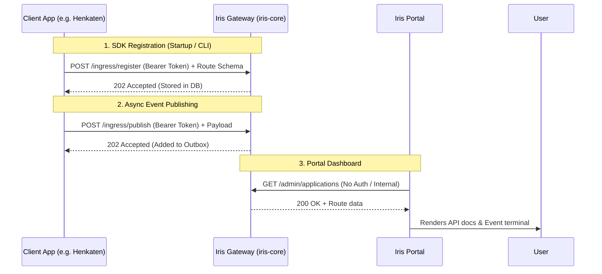

# IRIS Ecosystem Documentation

This document explains the architecture, integration patterns, and troubleshooting steps for the full Iris ecosystem: `iris-core` (the gateway), `iris-portal` (the UI dashboard), and the various SDKs (PHP/Laravel and JS/Node).

---

## 1. Architecture



**How it works:**
The ecosystem separates concerns cleanly. 
- **`iris-core`** is the central gateway. It holds the single-source-of-truth database (MySQL) and rabbitMQ connections.
- **Client SDKs** (PHP or JS) live inside your microservices (like the Henkaten app). They are responsible for pushing their route schemas and events to the gateway. They do NOT connect to the database directly; they only communicate via HTTP to `/ingress/*` using a secure token.
- **`iris-portal`** is a read-only dashboard. It fetches data directly from the gateway's `/admin/*` endpoints to visualize the network.

---

## 2. Zero-Config Discovery: The "No Hardcoding" Guarantee

> **⚠️ CURRENT STATUS: TODO / NOT FULLY IMPLEMENTED**
> 
> The architecture specification demands a "zero-config, no hardcoding" registration mechanism where a client app automatically registers itself on first boot using a rotating secret handshake, completely removing the need for a developer to copy-paste an Application ID or Token.
>
> **Actual Codebase Reality:** This auto-registration handshake does NOT exist yet. Currently, you **must** manually create the application in the Iris database (via the Admin API or Prisma script) to generate an `IRIS_PROJECT_TOKEN`, and then manually paste that token into your app's `.env` file. 
> 
> *Future implementation needed:* The SDK should generate a unique asymmetric keypair on install, push the public key to a new `/ingress/handshake` endpoint on the gateway using a one-time provisioning slug, and receive the permanent token in response.

---

## 3. PHP / Laravel SDK Integration

### Installation
The PHP SDK is a single, zero-dependency file (`Iris.php`). You don't need composer to download a massive package.
1. Copy `Iris.php` into your Laravel app (e.g., `app/Services/Iris.php`).
2. Register it using a Service Provider (`app/Providers/IrisServiceProvider.php`).

### Configuration
Add these to your `.env`:
```env
IRIS_PROJECT_TOKEN=your_generated_token_here
IRIS_GATEWAY_URL=http://localhost:3001
```

### The `php artisan iris:sync` Command
In Laravel 11, routing files are loaded *after* Service Providers boot. Because of this, and to prevent adding 100ms+ of latency to every web request, we **do not** sync routes automatically on `boot()`.

Instead, use the artisan command:
```bash
php artisan iris:sync
```
**What it actually does:**
1. Loads the Laravel environment and boots the framework.
2. Extracts all registered routes via `Route::getRoutes()`.
3. Normalizes them into the Iris Route Schema format.
4. Makes a single `POST /ingress/register` call to the gateway using the `.env` token.
5. *Note: It does not cache schemas locally or re-issue tokens. It simply pushes the current state.*

**When to run it:** Run this manually when adding new routes, or add it to your CI/CD deployment script so it runs automatically during deploys.

### Minimal Usage (Publishing an Event)
```php
use App\Services\Iris;

public function completeOrder(Iris $iris) {
    // Process order...
    
    // Fire and forget — durable outbox handles the rest
    $iris->publish('order_completed', ['order_id' => 123]);
}
```

---

## 4. JS / Node SDK Integration

### Installation
```bash
npm install @sugity/iris-node
```

### Configuration
Add to your `.env`:
```env
IRIS_PROJECT_TOKEN=your_generated_token_here
IRIS_GATEWAY_URL=http://localhost:3001
```

### Auto-Sync Mechanism
Unlike PHP, long-running Node apps (like Express or Fastify) build their route trees synchronously at startup. The JS SDK includes framework-specific discovery wrappers that hook into this process.

```typescript
import express from 'express';
import { Iris } from '@sugity/iris-node';
import { registerExpressApp } from '@sugity/iris-node/express';

const iris = new Iris(); // Picks up IRIS_PROJECT_TOKEN automatically
const app = express();

app.get('/api/users', (req, res) => res.send([]));

app.listen(3000, async () => {
    // 1. Validates token against gateway
    await iris.init(); 
    
    // 2. Auto-discovers Express stack and POSTs to /ingress/register
    await registerExpressApp(iris, app); 
});
```
**What it actually does:** `registerExpressApp` walks the internal Express `_router.stack`, pulls out the defined paths and methods, normalizes regex paths, and syncs them to the gateway.

### Minimal Usage (Publishing an Event)
```typescript
app.post('/api/checkout', async (req, res) => {
    // publish() falls back to an in-memory queue if the gateway is down
    await iris.publish({ event: 'checkout_started', data: req.body });
    res.send('ok');
});
```

---

## 5. Troubleshooting & Maintenance

### Common Trouble shoot and Sync Failures

**1. (NEW) X-Iris-Admin-Key header that Iris now requires for admin routes**
- *fix:* always put `X-Iris-Admin-Key: <your-admin-key>` header in your requests to iris-core
- *example:* the 502 Request failed error by updating absence.js to send the new X-Iris-Admin-Key header that Iris now requires for admin routes 
  *another example:* Failed to connect to iris-core: iris-core [401] /admin/applications: Invalid or missing X-Iris-Admin-Key
- *fixes:*
**2. Route count shows 0 in portal (PHP/Laravel)**
- *Cause:* You tried to put `$iris->syncRoutes()` inside a Service Provider's `boot()` method in Laravel 11. 
- *Fix:* Use `php artisan iris:sync`. The routes don't exist yet when `boot()` runs.

**3. "Failed to connect to iris-core [401]" in Portal**
- *Cause:* You have a zombie Node process running on port 3001 that is intercepting requests with stale code.
- *Fix:* Run `kill-port 3001` or manually kill the PIDs found via `netstat -ano | findstr ":3001"`.

**4. "Unauthorized: invalid token" during `iris:sync` or `iris.init()`**
- *Cause:* The `IRIS_PROJECT_TOKEN` in your `.env` does not match any application in the gateway's MySQL database. 
- *Fix:* Make sure the gateway is using the correct database (check `DATABASE_URL` in `iris-core`), or generate a new token and update your `.env`.

**5. Prisma "Can't reach database server"**
- *Cause:* You restarted your machine and XAMPP MySQL didn't start automatically.
- *Fix:* Open XAMPP Control Panel and start MySQL. No other config needed.

